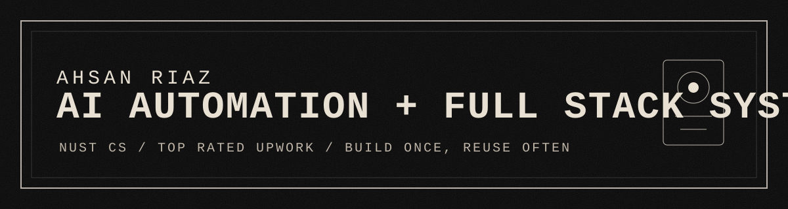
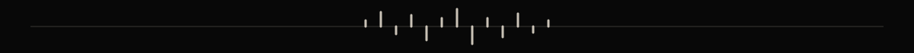
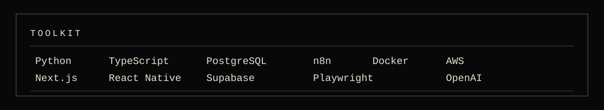
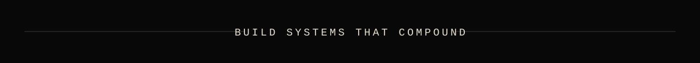

<div align="center">
  
</div>

<br />

I build AI automation systems, scalable web apps, scraping pipelines, and backend infrastructure that turns messy workflows into reliable software.

CS undergrad at NUST. Top Rated Upwork freelancer. Based in Faisalabad, Pakistan.

```txt
Focus       AI automation systems, full-stack products, scraping infrastructure
Stack       Next.js, React Native, Node.js, Python, PostgreSQL, Supabase, AWS
Automation  n8n, Make, OpenAI, Claude, Gemini, LangChain, LangGraph
Style       build once, reuse often, automate the boring path
```

<div align="center">
  
</div>

## What I Do

| Area | Signal |
| --- | --- |
| AI automation | Agents, workflow orchestration, OCR, prompt pipelines, API handoffs |
| Full-stack apps | Next.js, React, React Native, Express, FastAPI, Django, Flask |
| Scraping systems | Playwright, Selenium, Scrapy, BeautifulSoup, Celery |
| Data and infra | PostgreSQL, Supabase, MongoDB, Redis, Docker, AWS, Vercel |

## Operating Notes

- Systems over one-off scripts.
- Automation with validation, retries, and recovery paths.
- Clean interfaces between data, AI, backend, and user workflows.
- Practical builds that can survive real clients, real users, and weird edge cases.

## Toolkit

<div align="center">
  
</div>

## Contact

| Link | Where |
| --- | --- |
| GitHub | [github.com/AhsanRiaz786](https://github.com/AhsanRiaz786) |
| Email | [ahsanriaz8000@gmail.com](mailto:ahsanriaz8000@gmail.com) |
| LinkedIn | [linkedin.com/in/ahsan-riaz-1254992a3](https://www.linkedin.com/in/ahsan-riaz-1254992a3/) |
| Upwork | [upwork.com/freelancers/~01d4988598a9368ee5](https://www.upwork.com/freelancers/~01d4988598a9368ee5) |
| Website | [riaz.live](https://www.riaz.live) |

<div align="center">
  
</div>
